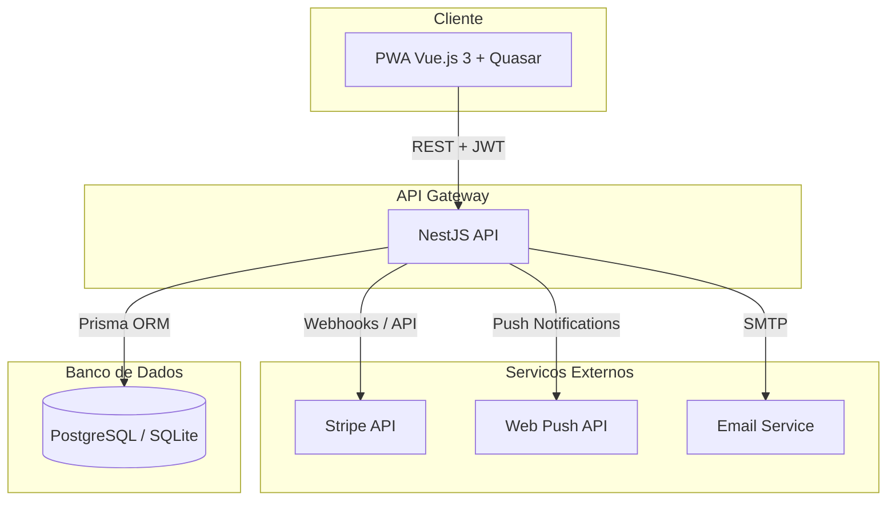
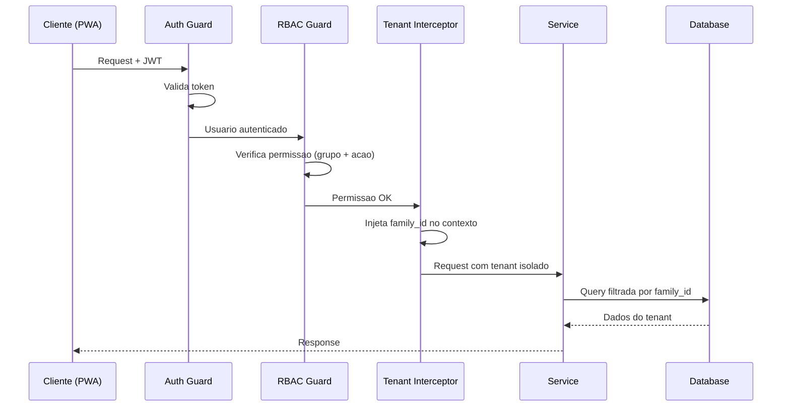
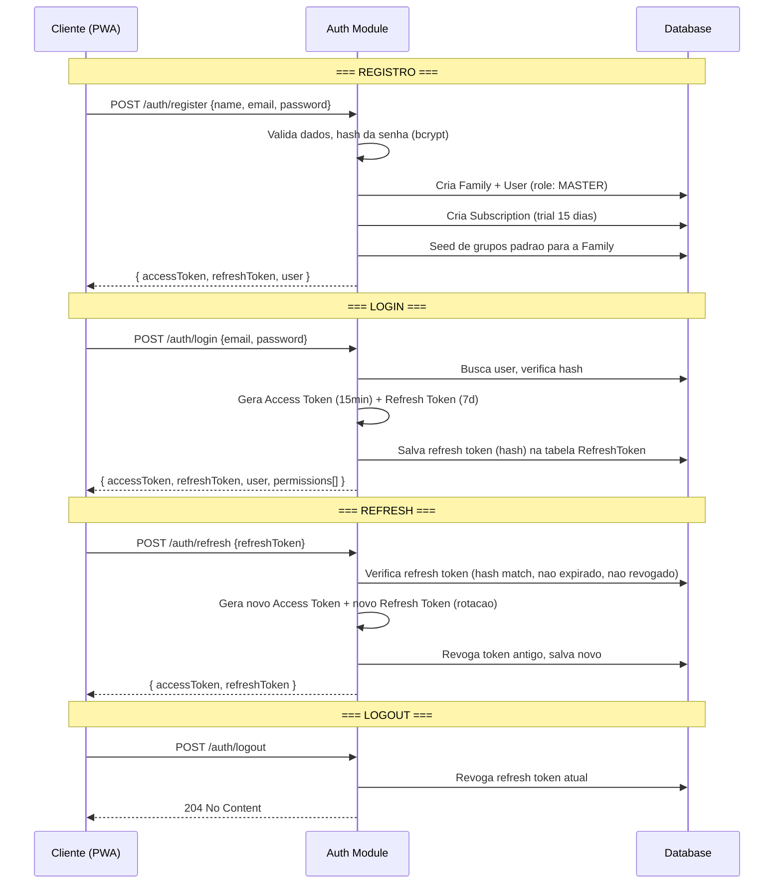
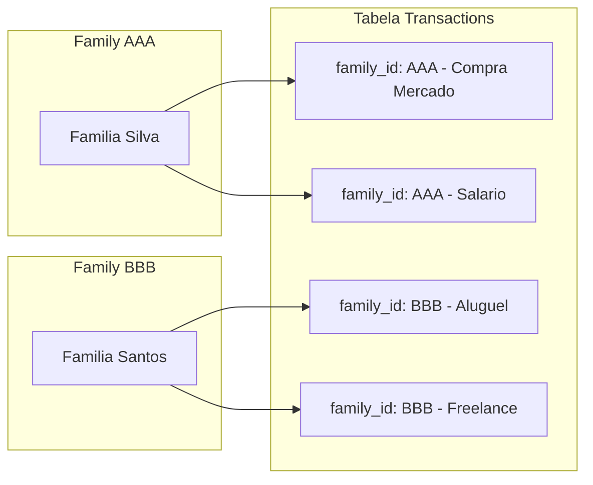
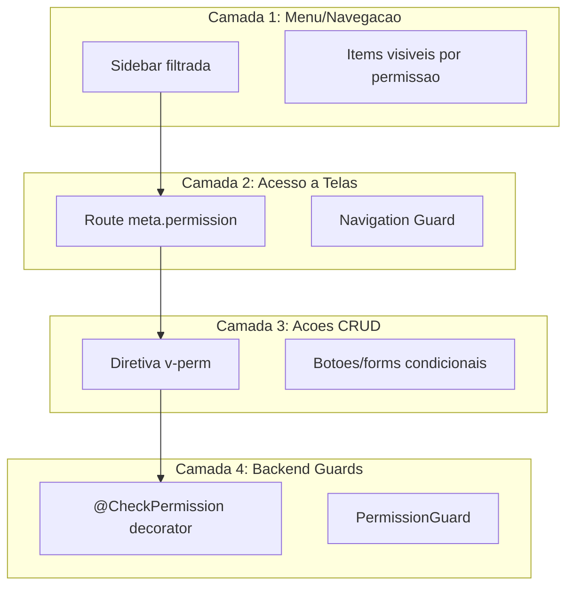
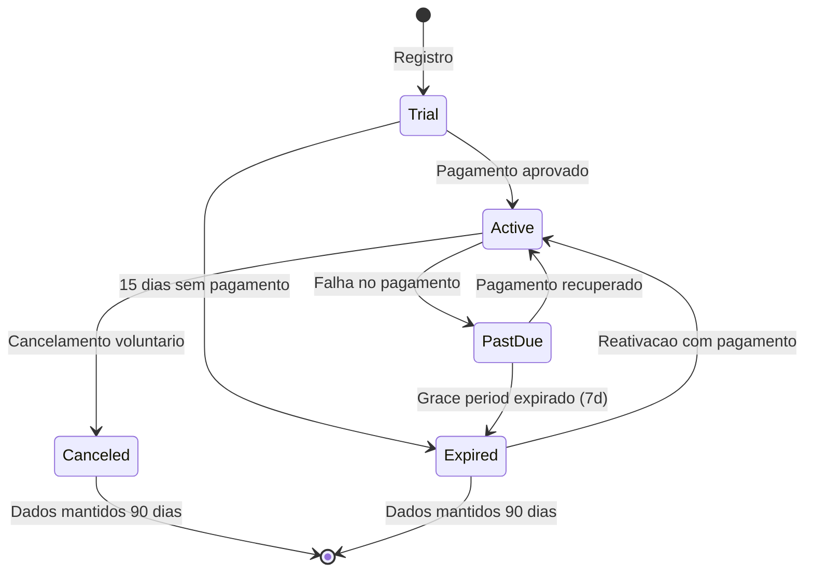
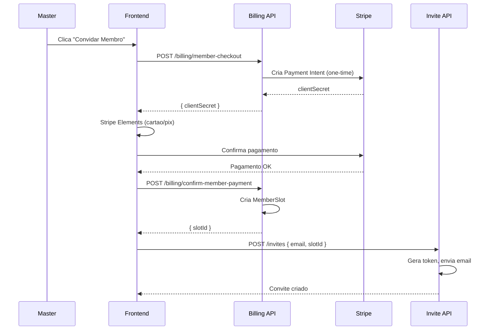
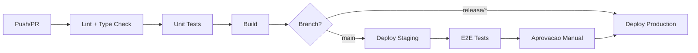

# Raji Finance - Arquitetura Geral

## 1. Visao Geral



### Diagrama de Fluxo de Requisicao



---

## 2. Estrutura do Monorepo

Decisao: **monorepo com workspaces npm** (ver ADR-001).

```
raji-finance/
├── package.json                  # Workspace root
├── turbo.json                    # Turborepo config (build, lint, test)
├── .env.example
├── .gitignore
├── docker-compose.yml            # PostgreSQL, Redis (futuro)
│
├── packages/
│   └── shared/                   # Pacote compartilhado
│       ├── package.json
│       └── src/
│           ├── types/            # Tipos TypeScript compartilhados
│           │   ├── auth.ts       # LoginDTO, TokenPayload, etc.
│           │   ├── user.ts       # UserDTO, CreateUserDTO
│           │   ├── transaction.ts
│           │   ├── account.ts
│           │   ├── budget.ts
│           │   ├── category.ts
│           │   ├── subscription.ts
│           │   └── index.ts
│           ├── enums/            # Enums compartilhados
│           │   ├── roles.ts
│           │   ├── permissions.ts
│           │   ├── transaction-type.ts
│           │   └── index.ts
│           ├── constants/        # Constantes (limites, defaults)
│           │   ├── billing.ts
│           │   ├── permissions.ts
│           │   └── index.ts
│           └── validators/       # Schemas Zod compartilhados
│               ├── auth.ts
│               ├── transaction.ts
│               └── index.ts
│
├── apps/
│   ├── api/                      # Backend NestJS
│   │   ├── package.json
│   │   ├── nest-cli.json
│   │   ├── tsconfig.json
│   │   ├── prisma/
│   │   │   ├── schema.prisma
│   │   │   ├── seed.ts
│   │   │   └── migrations/
│   │   ├── test/
│   │   │   ├── e2e/
│   │   │   └── unit/
│   │   └── src/
│   │       ├── main.ts
│   │       ├── app.module.ts
│   │       └── modules/          # (detalhado abaixo)
│   │
│   └── web/                      # Frontend Vue.js + Quasar
│       ├── package.json
│       ├── quasar.config.js
│       ├── tsconfig.json
│       └── src/
│           └── ...               # (detalhado abaixo)
│
└── docs/                         # Documentacao do projeto
    ├── architecture.md
    ├── prisma-schema.md
    └── adrs.md
```

---

## 3. Modulos NestJS (Backend)

Cada modulo segue o padrao NestJS: `module`, `controller`, `service`, `dto`, `guard/decorator` quando aplicavel.

```
apps/api/src/modules/
├── auth/                         # Autenticacao e sessao
│   ├── auth.module.ts
│   ├── auth.controller.ts        # POST /auth/login, /auth/register, /auth/refresh, /auth/logout
│   ├── auth.service.ts           # Login, registro, refresh token, logout
│   ├── strategies/
│   │   ├── jwt.strategy.ts       # Passport JWT Strategy
│   │   └── jwt-refresh.strategy.ts
│   ├── guards/
│   │   ├── jwt-auth.guard.ts     # Guard global de autenticacao
│   │   └── jwt-refresh.guard.ts
│   └── dto/
│       ├── login.dto.ts
│       ├── register.dto.ts
│       └── refresh-token.dto.ts
│
├── users/                        # Gestao de usuarios
│   ├── users.module.ts
│   ├── users.controller.ts       # GET/PATCH /users/me, GET /users/:id
│   ├── users.service.ts
│   └── dto/
│       └── update-user.dto.ts
│
├── families/                     # Gestao de familias (tenant)
│   ├── families.module.ts
│   ├── families.controller.ts    # POST /families, GET /families/me, PATCH /families/:id
│   ├── families.service.ts
│   └── dto/
│       └── create-family.dto.ts
│
├── rbac/                         # Controle de acesso baseado em funcoes
│   ├── rbac.module.ts
│   ├── rbac.controller.ts        # CRUD /groups, /permissions, /group-permissions
│   ├── rbac.service.ts           # Verificacao de permissoes, seed de grupos padrao
│   ├── guards/
│   │   └── permission.guard.ts   # Guard que le @CheckPermission()
│   ├── decorators/
│   │   └── check-permission.decorator.ts  # @CheckPermission('transactions', 'create')
│   └── dto/
│       ├── create-group.dto.ts
│       └── assign-permission.dto.ts
│
├── tenant/                       # Multi-tenancy
│   ├── tenant.module.ts
│   ├── tenant.interceptor.ts     # Interceptor que injeta family_id em todas as queries
│   ├── tenant.service.ts         # Helper para filtragem por tenant
│   └── decorators/
│       └── tenant-context.decorator.ts
│
├── accounts/                     # Contas bancarias, carteiras, cartoes
│   ├── accounts.module.ts
│   ├── accounts.controller.ts    # CRUD /accounts
│   ├── accounts.service.ts
│   └── dto/
│       ├── create-account.dto.ts
│       └── update-account.dto.ts
│
├── transactions/                 # Lancamentos financeiros
│   ├── transactions.module.ts
│   ├── transactions.controller.ts # CRUD /transactions, POST /transactions/import
│   ├── transactions.service.ts
│   ├── import/
│   │   ├── import.service.ts     # Parser CSV/OFX
│   │   ├── csv-parser.ts
│   │   └── ofx-parser.ts
│   └── dto/
│       ├── create-transaction.dto.ts
│       ├── update-transaction.dto.ts
│       └── import-transactions.dto.ts
│
├── categories/                   # Categorias e subcategorias
│   ├── categories.module.ts
│   ├── categories.controller.ts  # CRUD /categories, /subcategories
│   ├── categories.service.ts
│   └── dto/
│       ├── create-category.dto.ts
│       └── create-subcategory.dto.ts
│
├── recurring/                    # Transacoes recorrentes
│   ├── recurring.module.ts
│   ├── recurring.controller.ts   # CRUD /recurring-transactions
│   ├── recurring.service.ts      # Logica de geracao automatica
│   ├── recurring.scheduler.ts    # Cron job para gerar lancamentos
│   └── dto/
│       └── create-recurring.dto.ts
│
├── budgets/                      # Orcamentos por categoria
│   ├── budgets.module.ts
│   ├── budgets.controller.ts     # CRUD /budgets
│   ├── budgets.service.ts        # Calculo de consumo, alertas
│   └── dto/
│       └── create-budget.dto.ts
│
├── savings-goals/                # Metas de economia
│   ├── savings-goals.module.ts
│   ├── savings-goals.controller.ts # CRUD /savings-goals
│   ├── savings-goals.service.ts
│   └── dto/
│       └── create-savings-goal.dto.ts
│
├── billing/                      # Assinaturas e pagamentos
│   ├── billing.module.ts
│   ├── billing.controller.ts     # POST /billing/checkout, GET /billing/subscription
│   ├── billing.service.ts        # Logica de subscription, trial, paywall
│   ├── stripe/
│   │   ├── stripe.service.ts     # Integracao Stripe
│   │   └── stripe-webhook.controller.ts  # POST /webhooks/stripe
│   ├── pix/
│   │   └── pix.service.ts        # Integracao Pix (PSP)
│   ├── guards/
│   │   └── subscription.guard.ts # Guard que verifica se subscription esta ativa
│   └── dto/
│       ├── create-checkout.dto.ts
│       └── add-member.dto.ts
│
├── invites/                      # Convites de membros
│   ├── invites.module.ts
│   ├── invites.controller.ts     # POST /invites, GET /invites/:token, POST /invites/:token/accept
│   ├── invites.service.ts        # Geracao de token, aceite, vinculacao
│   └── dto/
│       └── create-invite.dto.ts
│
├── notifications/                # Notificacoes
│   ├── notifications.module.ts
│   ├── notifications.controller.ts # GET /notifications, PATCH /notifications/:id/read
│   ├── notifications.service.ts
│   ├── push/
│   │   └── push.service.ts       # Web Push (fase 1)
│   └── dto/
│       └── notification-preferences.dto.ts
│
├── dashboard/                    # Dashboards e relatorios
│   ├── dashboard.module.ts
│   ├── dashboard.controller.ts   # GET /dashboard/summary, /dashboard/cashflow, etc.
│   └── dashboard.service.ts      # Agregacoes e calculos
│
└── common/                       # Utilidades compartilhadas
    ├── common.module.ts
    ├── filters/
    │   └── http-exception.filter.ts
    ├── interceptors/
    │   ├── logging.interceptor.ts
    │   └── transform.interceptor.ts  # Padroniza responses
    ├── pipes/
    │   └── validation.pipe.ts
    └── decorators/
        ├── current-user.decorator.ts    # @CurrentUser() extrai user do request
        └── current-family.decorator.ts  # @CurrentFamily() extrai family_id
```

### Tabela de Responsabilidades

| Modulo          | Responsabilidade                    | Depende de                                      |
| --------------- | ----------------------------------- | ----------------------------------------------- |
| `auth`          | Login, registro, JWT, refresh token | `users`, `families`, `rbac`                     |
| `users`         | CRUD de usuarios                    | `tenant`                                        |
| `families`      | CRUD de familias, configuracoes     | `tenant`                                        |
| `rbac`          | Grupos, permissoes, guards          | `tenant`                                        |
| `tenant`        | Isolamento multi-tenant             | -                                               |
| `accounts`      | Contas bancarias/carteiras          | `tenant`, `rbac`                                |
| `transactions`  | Lancamentos, importacao CSV/OFX     | `tenant`, `rbac`, `accounts`, `categories`      |
| `categories`    | Categorias e subcategorias          | `tenant`, `rbac`                                |
| `recurring`     | Recorrencias e agendamento          | `tenant`, `rbac`, `transactions`                |
| `budgets`       | Orcamentos e alertas                | `tenant`, `rbac`, `categories`, `transactions`  |
| `savings-goals` | Metas de economia                   | `tenant`, `rbac`                                |
| `billing`       | Stripe, Pix, subscription, paywall  | `families`, `users`                             |
| `invites`       | Convites de membros                 | `billing`, `families`, `rbac`                   |
| `notifications` | Push, in-app                        | `users`, `tenant`                               |
| `dashboard`     | Agregacoes e graficos               | `transactions`, `budgets`, `accounts`, `tenant` |

---

## 4. Estrutura de Pastas do Frontend (Vue.js + Quasar)

```
apps/web/src/
├── App.vue
├── main.ts
├── quasar-user-options.ts
│
├── boot/                         # Boot files do Quasar
│   ├── axios.ts                  # Configuracao do Axios (base URL, interceptors JWT)
│   ├── auth.ts                   # Inicializacao de auth (verificar token ao carregar)
│   ├── rbac.ts                   # Registro da diretiva v-perm
│   └── apexcharts.ts             # Registro global do ApexCharts
│
├── router/
│   ├── index.ts                  # Instancia do Vue Router
│   ├── routes.ts                 # Definicao de todas as rotas
│   └── guards/
│       ├── auth.guard.ts         # Verifica se esta logado
│       ├── subscription.guard.ts # Verifica se subscription esta ativa (paywall)
│       └── permission.guard.ts   # Verifica permissao de acesso a tela (meta.permission)
│
├── stores/                       # Pinia stores
│   ├── auth.store.ts             # Token, user logado, login/logout
│   ├── user.store.ts             # Dados do usuario
│   ├── family.store.ts           # Familia atual, membros
│   ├── rbac.store.ts             # Permissoes do usuario logado (cache)
│   ├── accounts.store.ts         # Contas
│   ├── transactions.store.ts     # Transacoes
│   ├── categories.store.ts       # Categorias e subcategorias
│   ├── budgets.store.ts          # Orcamentos
│   ├── savings-goals.store.ts    # Metas
│   ├── billing.store.ts          # Subscription, plano, status
│   ├── notifications.store.ts    # Notificacoes
│   └── dashboard.store.ts        # Dados agregados do dashboard
│
├── services/                     # Camada de API (Axios wrappers)
│   ├── api.ts                    # Instancia Axios configurada
│   ├── auth.service.ts
│   ├── users.service.ts
│   ├── families.service.ts
│   ├── accounts.service.ts
│   ├── transactions.service.ts
│   ├── categories.service.ts
│   ├── budgets.service.ts
│   ├── savings-goals.service.ts
│   ├── billing.service.ts
│   ├── invites.service.ts
│   ├── notifications.service.ts
│   └── dashboard.service.ts
│
├── composables/                  # Composition API hooks
│   ├── useAuth.ts                # Logica de autenticacao
│   ├── usePermission.ts          # hasPermission(), canAccess()
│   ├── useSubscription.ts        # isActive(), isTrialExpired()
│   ├── useCurrency.ts            # Formatacao de moeda (BRL)
│   ├── useDate.ts                # Formatacao de datas
│   ├── useNotification.ts        # Toast/push helpers
│   └── usePagination.ts          # Paginacao padronizada
│
├── directives/
│   └── v-perm.ts                 # Diretiva v-perm="'transactions:create'"
│                                 # Esconde/desabilita elementos sem permissao
│
├── layouts/
│   ├── MainLayout.vue            # Layout com sidebar, header, breadcrumb
│   ├── AuthLayout.vue            # Layout para login/registro (sem sidebar)
│   └── components/
│       ├── TheSidebar.vue        # Menu lateral (filtrado por permissao)
│       ├── TheHeader.vue         # Header com notificacoes, avatar, family switcher
│       └── TheBreadcrumb.vue
│
├── pages/
│   ├── auth/
│   │   ├── LoginPage.vue
│   │   ├── RegisterPage.vue
│   │   ├── ForgotPasswordPage.vue
│   │   └── AcceptInvitePage.vue
│   │
│   ├── dashboard/
│   │   └── DashboardPage.vue     # Graficos, resumo, saldo, fluxo de caixa
│   │
│   ├── accounts/
│   │   ├── AccountsListPage.vue
│   │   └── AccountDetailPage.vue
│   │
│   ├── transactions/
│   │   ├── TransactionsListPage.vue
│   │   ├── TransactionFormPage.vue
│   │   └── ImportPage.vue        # Upload CSV/OFX, preview, confirmacao
│   │
│   ├── categories/
│   │   └── CategoriesPage.vue    # Arvore de categorias/subcategorias
│   │
│   ├── recurring/
│   │   └── RecurringListPage.vue
│   │
│   ├── budgets/
│   │   ├── BudgetsListPage.vue
│   │   └── BudgetDetailPage.vue  # Progresso por categoria
│   │
│   ├── savings-goals/
│   │   ├── GoalsListPage.vue
│   │   └── GoalDetailPage.vue    # Progresso, contribuicoes
│   │
│   ├── family/
│   │   ├── FamilySettingsPage.vue
│   │   ├── MembersPage.vue       # Lista membros, convites pendentes
│   │   └── InviteMemberPage.vue  # Fluxo com checkout
│   │
│   ├── rbac/
│   │   ├── GroupsPage.vue        # Lista de grupos
│   │   └── PermissionsMatrixPage.vue  # Matriz de permissoes editavel
│   │
│   ├── billing/
│   │   ├── SubscriptionPage.vue  # Plano atual, historico
│   │   └── CheckoutPage.vue      # Stripe Checkout / Pix QR
│   │
│   ├── notifications/
│   │   └── NotificationsPage.vue
│   │
│   └── errors/
│       ├── Error404Page.vue
│       └── PaywallPage.vue       # Tela de bloqueio por inadimplencia
│
├── components/                   # Componentes reutilizaveis
│   ├── common/
│   │   ├── CurrencyInput.vue     # Input monetario formatado
│   │   ├── DatePicker.vue
│   │   ├── ConfirmDialog.vue
│   │   ├── EmptyState.vue
│   │   └── LoadingOverlay.vue
│   │
│   ├── charts/
│   │   ├── CashFlowChart.vue     # Grafico de fluxo de caixa (ApexCharts)
│   │   ├── ExpensesByCategoryChart.vue  # Pizza/donut
│   │   ├── MonthlyTrendChart.vue        # Linha/area
│   │   └── BudgetProgressChart.vue      # Barra horizontal
│   │
│   └── transactions/
│       ├── TransactionItem.vue
│       ├── TransactionFilters.vue
│       └── ImportPreviewTable.vue
│
├── utils/
│   ├── currency.ts               # Helpers de formatacao BRL
│   ├── date.ts                   # Helpers de data (date-fns)
│   ├── validators.ts             # Regras de validacao Quasar
│   └── file-parsers.ts           # Helpers para preview de CSV/OFX
│
├── assets/
│   ├── styles/
│   │   ├── variables.scss        # Variaveis Quasar/SCSS customizadas
│   │   └── global.scss
│   └── images/
│       └── logo.svg
│
└── types/
    └── index.ts                  # Re-export de @raji/shared + tipos locais
```

---

## 5. Estrategia de Comunicacao Frontend <-> Backend

### Padrao REST

Todas as rotas seguem o padrao RESTful:

| Recurso      | Metodo | Endpoint                     | Descricao                  |
| ------------ | ------ | ---------------------------- | -------------------------- |
| Auth         | POST   | `/api/auth/register`         | Registro                   |
| Auth         | POST   | `/api/auth/login`            | Login                      |
| Auth         | POST   | `/api/auth/refresh`          | Refresh token              |
| Auth         | POST   | `/api/auth/logout`           | Logout                     |
| Accounts     | GET    | `/api/accounts`              | Listar contas              |
| Accounts     | POST   | `/api/accounts`              | Criar conta                |
| Accounts     | GET    | `/api/accounts/:id`          | Detalhe                    |
| Accounts     | PATCH  | `/api/accounts/:id`          | Atualizar                  |
| Accounts     | DELETE | `/api/accounts/:id`          | Remover                    |
| Transactions | GET    | `/api/transactions`          | Listar (com filtros)       |
| Transactions | POST   | `/api/transactions`          | Criar                      |
| Transactions | POST   | `/api/transactions/import`   | Importar CSV/OFX           |
| Categories   | GET    | `/api/categories`            | Listar (com subcategorias) |
| Budgets      | GET    | `/api/budgets`               | Listar orcamentos          |
| Budgets      | GET    | `/api/budgets/:id/progress`  | Progresso do orcamento     |
| Dashboard    | GET    | `/api/dashboard/summary`     | Resumo financeiro          |
| Dashboard    | GET    | `/api/dashboard/cashflow`    | Fluxo de caixa             |
| Billing      | POST   | `/api/billing/checkout`      | Iniciar checkout           |
| Billing      | GET    | `/api/billing/subscription`  | Status da subscription     |
| Invites      | POST   | `/api/invites`               | Criar convite              |
| Invites      | POST   | `/api/invites/:token/accept` | Aceitar convite            |

### Contrato de Response Padronizado

```typescript
// Sucesso
{
  "success": true,
  "data": { ... },
  "meta": {                    // Opcional, para listas paginadas
    "page": 1,
    "perPage": 20,
    "total": 150,
    "totalPages": 8
  }
}

// Erro
{
  "success": false,
  "error": {
    "code": "INSUFFICIENT_PERMISSION",
    "message": "Voce nao tem permissao para criar transacoes",
    "details": { ... }        // Opcional, erros de validacao
  }
}
```

### Interceptors Axios (Frontend)

```typescript
// boot/axios.ts
api.interceptors.request.use((config) => {
  const authStore = useAuthStore();
  if (authStore.accessToken) {
    config.headers.Authorization = `Bearer ${authStore.accessToken}`;
  }
  return config;
});

api.interceptors.response.use(
  (response) => response,
  async (error) => {
    if (error.response?.status === 401 && !error.config._retry) {
      error.config._retry = true;
      const authStore = useAuthStore();
      await authStore.refreshToken();
      error.config.headers.Authorization = `Bearer ${authStore.accessToken}`;
      return api(error.config);
    }
    if (error.response?.status === 403) {
      // Redirecionar para paywall se for problema de subscription
      // Ou mostrar toast de "sem permissao"
    }
    return Promise.reject(error);
  },
);
```

---

## 6. Estrategia de Autenticacao (JWT)

### Fluxo Completo



### Token Payload (Access Token)

```typescript
interface JwtPayload {
  sub: string; // user.id (UUID)
  email: string;
  familyId: string; // family.id (UUID) — pilar do multi-tenancy
  groupId: string; // group.id — para RBAC rapido
  type: 'access';
  iat: number;
  exp: number; // 15 minutos
}
```

### Token Payload (Refresh Token)

```typescript
interface RefreshTokenPayload {
  sub: string; // user.id
  familyId: string;
  tokenId: string; // ID unico do refresh token (para revogacao)
  type: 'refresh';
  iat: number;
  exp: number; // 7 dias
}
```

### Configuracoes de Seguranca

| Parametro                | Valor                      | Justificativa                       |
| ------------------------ | -------------------------- | ----------------------------------- |
| Access Token TTL         | 15 minutos                 | Curto para limitar janela de ataque |
| Refresh Token TTL        | 7 dias                     | Equilibrio entre UX e seguranca     |
| Rotacao de Refresh Token | Sim                        | Novo refresh token a cada uso       |
| Hash do Refresh Token    | bcrypt                     | Token salvo como hash no DB         |
| Revogacao                | Por token e por familia    | Logout e "deslogar todos"           |
| Algoritmo JWT            | HS256 (dev) / RS256 (prod) | Assimetrico em producao             |
| Password Hash            | bcrypt (salt rounds: 12)   | Padrao da industria                 |

---

## 7. Estrategia de Multi-Tenancy

### Modelo: Banco Compartilhado com Coluna Discriminadora

Todas as tabelas de dados de negocio possuem uma coluna `family_id` que funciona como discriminador de tenant.



### Implementacao no Backend

**1. Tenant Interceptor (aplicado globalmente):**

```typescript
// modules/tenant/tenant.interceptor.ts
@Injectable()
export class TenantInterceptor implements NestInterceptor {
  intercept(context: ExecutionContext, next: CallHandler) {
    const request = context.switchToHttp().getRequest();
    const user = request.user; // Injetado pelo JwtAuthGuard

    if (user?.familyId) {
      // Injeta familyId no request para uso nos services
      request.tenantId = user.familyId;
    }

    return next.handle();
  }
}
```

**2. Decorator para extrair tenant:**

```typescript
// modules/common/decorators/current-family.decorator.ts
export const CurrentFamily = createParamDecorator(
  (data: unknown, ctx: ExecutionContext): string => {
    const request = ctx.switchToHttp().getRequest();
    return request.tenantId;
  },
);
```

**3. Uso nos Controllers/Services:**

```typescript
@Get()
@CheckPermission('transactions', 'read')
async findAll(@CurrentFamily() familyId: string, @Query() filters: FilterDto) {
  return this.transactionsService.findAll(familyId, filters);
}

// No service:
async findAll(familyId: string, filters: FilterDto) {
  return this.prisma.transaction.findMany({
    where: {
      familyId,           // SEMPRE filtrar por tenant
      ...this.buildFilters(filters),
    },
  });
}
```

### Regras de Isolamento

1. **Toda query de leitura** DEVE incluir `where: { familyId }`.
2. **Toda criacao** DEVE incluir `familyId` no `data`.
3. **Toda atualizacao/exclusao** DEVE incluir `familyId` no `where` (previne acesso horizontal).
4. **Indices compostos** `(familyId, ...)` em todas as tabelas para performance.
5. **Testes automatizados** devem validar isolamento entre tenants.

---

## 8. Estrategia de RBAC (End-to-End)

### Arquitetura de 4 Camadas



### Grupos Padrao

| Grupo          | Slug          | Permissoes                                   |
| -------------- | ------------- | -------------------------------------------- |
| Master/Titular | `master`      | Tudo. Nao editavel. Unico por familia.       |
| Membro Full    | `member-full` | CRUD completo em financas. Sem billing/RBAC. |
| Dependente     | `dependent`   | Somente leitura em tudo.                     |

Grupos customizaveis podem ser criados pelo Master com qualquer combinacao de permissoes.

### Modelo de Permissoes

Cada permissao e definida como `modulo:acao`:

```typescript
// Exemplos de permissoes
const PERMISSIONS = {
  accounts: ['create', 'read', 'update', 'delete'],
  transactions: ['create', 'read', 'update', 'delete', 'import'],
  categories: ['create', 'read', 'update', 'delete'],
  budgets: ['create', 'read', 'update', 'delete'],
  savings_goals: ['create', 'read', 'update', 'delete'],
  recurring: ['create', 'read', 'update', 'delete'],
  family: ['read', 'update'],
  members: ['read', 'invite', 'remove', 'change_group'],
  groups: ['create', 'read', 'update', 'delete'],
  billing: ['read', 'manage'],
  reports: ['read'],
  notifications: ['read', 'manage'],
};
```

### Frontend: Diretiva `v-perm`

```typescript
// directives/v-perm.ts
const vPerm: Directive = {
  mounted(el, binding) {
    const rbacStore = useRbacStore();
    const permission = binding.value; // ex: 'transactions:create'
    const mode = binding.arg || 'hide'; // 'hide' | 'disable'

    if (!rbacStore.hasPermission(permission)) {
      if (mode === 'disable') {
        el.setAttribute('disabled', 'true');
        el.classList.add('opacity-50', 'cursor-not-allowed');
      } else {
        el.style.display = 'none';
      }
    }
  },
};

// Uso nos templates:
// <q-btn v-perm="'transactions:create'" label="Nova Transacao" />
// <q-btn v-perm:disable="'transactions:delete'" label="Excluir" />
```

### Frontend: Navigation Guard

```typescript
// router/guards/permission.guard.ts
router.beforeEach((to, from, next) => {
  const rbacStore = useRbacStore();
  const requiredPermission = to.meta.permission as string;

  if (requiredPermission && !rbacStore.hasPermission(requiredPermission)) {
    next({ name: 'forbidden' });
    return;
  }
  next();
});

// Definicao de rota:
{
  path: '/transactions',
  component: TransactionsListPage,
  meta: { permission: 'transactions:read' }
}
```

### Backend: Decorator + Guard

```typescript
// decorators/check-permission.decorator.ts
export const CheckPermission = (module: string, action: string) =>
  SetMetadata('permission', { module, action });

// guards/permission.guard.ts
@Injectable()
export class PermissionGuard implements CanActivate {
  constructor(
    private reflector: Reflector,
    private rbacService: RbacService,
  ) {}

  async canActivate(context: ExecutionContext): Promise<boolean> {
    const permission = this.reflector.get('permission', context.getHandler());
    if (!permission) return true; // Sem decorator = acesso livre

    const request = context.switchToHttp().getRequest();
    const user = request.user;

    return this.rbacService.userHasPermission(user.groupId, permission.module, permission.action);
  }
}
```

---

## 9. Estrategia de Billing/Subscription

### Fluxo de Vida da Subscription



### Modelo de Precificacao

| Item                   | Valor           | Tipo                              |
| ---------------------- | --------------- | --------------------------------- |
| Plano mensal (titular) | R$ X/mes        | Recorrente (Stripe)               |
| Membro adicional       | R$ Y (one-time) | Cobranca unica por membro         |
| Trial                  | 15 dias         | Gratuito, funcionalidade completa |

### Fluxo de Checkout para Membro Adicional



### Paywall (Guard de Subscription)

```typescript
// billing/guards/subscription.guard.ts
@Injectable()
export class SubscriptionGuard implements CanActivate {
  constructor(private billingService: BillingService) {}

  async canActivate(context: ExecutionContext): Promise<boolean> {
    const request = context.switchToHttp().getRequest();
    const familyId = request.tenantId;

    const subscription = await this.billingService.getActiveSubscription(familyId);

    if (!subscription) {
      throw new ForbiddenException({
        code: 'SUBSCRIPTION_REQUIRED',
        message: 'Assinatura necessaria para acessar este recurso',
      });
    }

    if (subscription.status === 'EXPIRED' || subscription.status === 'PAST_DUE') {
      throw new ForbiddenException({
        code: 'SUBSCRIPTION_INACTIVE',
        message: 'Sua assinatura esta inativa. Regularize para continuar.',
      });
    }

    // Trial ativo ou subscription ativa = OK
    return true;
  }
}
```

No **frontend**, o `subscription.guard.ts` no router redireciona para `/paywall` se a subscription nao esta ativa, permitindo apenas leitura (rotas GET sem guard de subscription).

---

## 10. Ambientes

### Configuracao por Ambiente

| Aspecto            | Development              | Staging                      | Production                    |
| ------------------ | ------------------------ | ---------------------------- | ----------------------------- |
| Banco de dados     | SQLite local             | PostgreSQL (container)       | PostgreSQL (managed)          |
| JWT Secret         | Valor fixo em .env       | Variavel de ambiente         | Secrets manager (ex: AWS SSM) |
| JWT Algoritmo      | HS256                    | RS256                        | RS256                         |
| Stripe             | Test mode + webhooks CLI | Test mode + webhook endpoint | Live mode                     |
| Email              | Ethereal/Mailtrap        | Mailtrap                     | SES/SendGrid                  |
| Push Notifications | Console log              | Web Push (test)              | Web Push (prod)               |
| CORS               | `localhost:*`            | Dominio staging              | Dominio producao              |
| Rate Limiting      | Desabilitado             | Habilitado (permissivo)      | Habilitado (restritivo)       |
| Logs               | Console (verbose)        | JSON (info)                  | JSON (warn/error) + APM       |

### Variaveis de Ambiente (.env)

```bash
# App
NODE_ENV=development
PORT=3000
APP_URL=http://localhost:9000

# Database
DATABASE_URL="file:./dev.db"            # SQLite (dev)
# DATABASE_URL="postgresql://..."        # PostgreSQL (staging/prod)

# JWT
JWT_ACCESS_SECRET=sua-chave-secreta-dev
JWT_REFRESH_SECRET=outra-chave-secreta-dev
JWT_ACCESS_EXPIRATION=15m
JWT_REFRESH_EXPIRATION=7d

# Stripe
STRIPE_SECRET_KEY=sk_test_...
STRIPE_WEBHOOK_SECRET=whsec_...
STRIPE_MONTHLY_PRICE_ID=price_...
STRIPE_MEMBER_PRICE_ID=price_...

# Push Notifications
VAPID_PUBLIC_KEY=...
VAPID_PRIVATE_KEY=...

# Email
SMTP_HOST=smtp.ethereal.email
SMTP_PORT=587
SMTP_USER=...
SMTP_PASS=...
```

### Pipeline CI/CD (Sugerida)



### Infraestrutura Sugerida (Producao)

```
                    ┌──────────────────┐
                    │   Cloudflare     │
                    │   (CDN + WAF)    │
                    └────────┬─────────┘
                             │
                ┌────────────┴────────────┐
                │                         │
        ┌───────┴──────┐         ┌───────┴──────┐
        │  Frontend     │         │  Backend      │
        │  (Vercel/     │         │  (Railway/    │
        │   Netlify)    │         │   Fly.io/     │
        │               │         │   Render)     │
        └──────────────┘         └───────┬──────┘
                                         │
                                ┌────────┴────────┐
                                │  PostgreSQL      │
                                │  (Supabase/      │
                                │   Neon/Railway)  │
                                └─────────────────┘
```

---

## Status de Implementacao — Sprint 1 (v0.1.1)

> Atualizado em 2026-04-04 (v0.1.1)

### Modulos Backend Implementados

| Modulo     | Status       | Controllers                            | Services                                                        | DTOs                                                                      | Guards/Decorators                                                                                                  | Testes                 |
| ---------- | ------------ | -------------------------------------- | --------------------------------------------------------------- | ------------------------------------------------------------------------- | ------------------------------------------------------------------------------------------------------------------ | ---------------------- |
| `auth`     | Implementado | `auth.controller.ts` (4 endpoints)     | `auth.service.ts` (register, login, refresh, logout)            | `register.dto.ts`, `login.dto.ts`, `refresh-token.dto.ts`                 | `jwt-auth.guard.ts`, `jwt-refresh.guard.ts`, `@Public()`                                                           | Unitarios + Integracao |
| `users`    | Implementado | `users.controller.ts` (3 endpoints)    | `users.service.ts` (findMe, findById, updateMe)                 | `update-user.dto.ts`                                                      | `@CurrentUser()`                                                                                                   | Unitarios              |
| `families` | Implementado | `families.controller.ts` (3 endpoints) | `families.service.ts` (findMyFamily, updateFamily, listMembers) | `update-family.dto.ts`                                                    | `@CurrentFamily()`                                                                                                 | Unitarios              |
| `rbac`     | Implementado | `rbac.controller.ts` (6 endpoints)     | `rbac.service.ts` (CRUD grupos, permissoes, seed)               | `create-group.dto.ts`, `update-group.dto.ts`, `assign-permissions.dto.ts` | `permission.guard.ts`, `@CheckPermission()`                                                                        | Unitarios              |
| `tenant`   | Implementado | -                                      | `tenant.service.ts`                                             | -                                                                         | `tenant.interceptor.ts` (global)                                                                                   | Integracao             |
| `common`   | Implementado | -                                      | -                                                               | -                                                                         | `http-exception.filter.ts`, `transform.interceptor.ts`, `validation.pipe.ts`, `@CurrentUser()`, `@CurrentFamily()` | -                      |

### Endpoints da API (Sprint 1)

| Metodo | Endpoint                         | Modulo   | Status       |
| ------ | -------------------------------- | -------- | ------------ |
| POST   | `/api/v1/auth/register`          | Auth     | Implementado |
| POST   | `/api/v1/auth/login`             | Auth     | Implementado |
| POST   | `/api/v1/auth/refresh`           | Auth     | Implementado |
| POST   | `/api/v1/auth/logout`            | Auth     | Implementado |
| GET    | `/api/v1/users/me`               | Users    | Implementado |
| GET    | `/api/v1/users/:id`              | Users    | Implementado |
| PATCH  | `/api/v1/users/me`               | Users    | Implementado |
| GET    | `/api/v1/families/me`            | Families | Implementado |
| PATCH  | `/api/v1/families/me`            | Families | Implementado |
| GET    | `/api/v1/families/me/members`    | Families | Implementado |
| GET    | `/api/v1/groups`                 | RBAC     | Implementado |
| POST   | `/api/v1/groups`                 | RBAC     | Implementado |
| PATCH  | `/api/v1/groups/:id`             | RBAC     | Implementado |
| DELETE | `/api/v1/groups/:id`             | RBAC     | Implementado |
| GET    | `/api/v1/groups/permissions`     | RBAC     | Implementado |
| PUT    | `/api/v1/groups/:id/permissions` | RBAC     | Implementado |

**Total: 16 endpoints implementados na Sprint 1.**

### Paginas Frontend Implementadas (v0.1.1)

| Pagina                | Rota              | Store             | Service               | Status          |
| --------------------- | ----------------- | ----------------- | --------------------- | --------------- |
| LoginPage             | `/login`          | `auth.store.ts`   | `auth.service.ts`     | Implementado    |
| RegisterPage          | `/register`       | `auth.store.ts`   | `auth.service.ts`     | Implementado    |
| ProfilePage           | `/profile`        | `auth.store.ts`   | `users.service.ts`    | **Novo v0.1.1** |
| FamilySettingsPage    | `/family`         | `family.store.ts` | `families.service.ts` | **Novo v0.1.1** |
| MembersPage           | `/family/members` | `family.store.ts` | `families.service.ts` | **Novo v0.1.1** |
| GroupsPage            | `/rbac/groups`    | `rbac.store.ts`   | `rbac.service.ts`     | Implementado    |
| PermissionsMatrixPage | `/rbac/matrix`    | `rbac.store.ts`   | `rbac.service.ts`     | Implementado    |
| Error404Page          | `/*`              | -                 | -                     | Implementado    |
| ForbiddenPage         | -                 | -                 | -                     | Implementado    |
| PaywallPage           | `/paywall`        | -                 | -                     | Implementado    |

### Novos Services e Stores (v0.1.1)

| Arquivo               | Tipo    | Descricao                                         |
| --------------------- | ------- | ------------------------------------------------- |
| `families.service.ts` | Service | getMyFamily, updateMyFamily, listMembers          |
| `family.store.ts`     | Store   | Estado da familia, membros, acoes de carga/edicao |

### Modulos Pendentes (Sprints 2-6)

| Modulo          | Sprint Planejada | Status   |
| --------------- | ---------------- | -------- |
| `accounts`      | Sprint 2         | Pendente |
| `categories`    | Sprint 2         | Pendente |
| `transactions`  | Sprint 2         | Pendente |
| `recurring`     | Sprint 3         | Pendente |
| `budgets`       | Sprint 3         | Pendente |
| `savings-goals` | Sprint 3         | Pendente |
| `billing`       | Sprint 4         | Pendente |
| `invites`       | Sprint 4         | Pendente |
| `dashboard`     | Sprint 5         | Pendente |
| `notifications` | Sprint 5         | Pendente |

### Infraestrutura Implementada (Sprint 0 + 1)

| Item                                        | Status       |
| ------------------------------------------- | ------------ |
| Monorepo Turborepo + npm workspaces         | Implementado |
| NestJS scaffold + modulos base              | Implementado |
| Vue.js + Quasar scaffold                    | Implementado |
| Pacote `@raji/shared`                       | Implementado |
| Prisma schema (20+ models)                  | Implementado |
| Seed de permissoes e dados iniciais         | Implementado |
| Docker Compose (PostgreSQL)                 | Implementado |
| CI/CD GitHub Actions                        | Implementado |
| ESLint + Prettier + Husky + Commitlint      | Implementado |
| Swagger UI (`/api/docs`)                    | Implementado |
| JWT Auth (access + refresh com rotacao)     | Implementado |
| Multi-tenancy (Tenant Interceptor)          | Implementado |
| RBAC 4 camadas (backend + frontend)         | Implementado |
| Response padronizado (TransformInterceptor) | Implementado |
| Validacao global (ValidationPipe)           | Implementado |

---

## Proximos Passos

1. **Sprint 2:** Implementar `accounts`, `categories`, `transactions` (core financeiro)
2. **Sprint 3:** Implementar `recurring`, `budgets`, `savings-goals` (features financeiras)
3. **Sprint 4:** Implementar `billing`, `invites` (monetizacao)
4. **Sprint 5:** Implementar `dashboard`, `notifications` (experiencia)
5. **Sprint 6:** Importacao CSV/OFX, refinamentos, testes E2E, deploy producao
