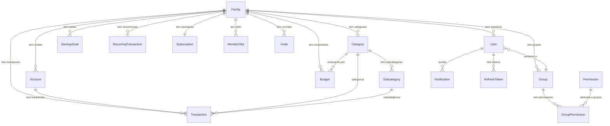

# Raji Finance - Schema Prisma Completo

## Visao Geral do Modelo de Dados



---

## Schema Prisma Completo

```prisma
// prisma/schema.prisma

generator client {
  provider = "prisma-client-js"
}

datasource db {
  provider = "postgresql" // Trocar para "sqlite" em dev se necessario
  url      = env("DATABASE_URL")
}

// ============================================================
// ENUMS
// ============================================================

/// Status da assinatura da familia
enum SubscriptionStatus {
  TRIAL       // Periodo de teste (15 dias)
  ACTIVE      // Pagamento em dia
  PAST_DUE    // Falha no pagamento (grace period)
  EXPIRED     // Trial ou grace period expirado
  CANCELED    // Cancelado voluntariamente
}

/// Tipo de conta financeira
enum AccountType {
  CHECKING    // Conta corrente
  SAVINGS     // Poupanca
  WALLET      // Carteira (dinheiro fisico)
  CREDIT_CARD // Cartao de credito
  INVESTMENT  // Investimento
  OTHER       // Outro
}

/// Tipo de transacao financeira
enum TransactionType {
  INCOME      // Receita
  EXPENSE     // Despesa
  TRANSFER    // Transferencia entre contas
}

/// Frequencia de transacao recorrente
enum RecurrenceFrequency {
  DAILY       // Diaria
  WEEKLY      // Semanal
  BIWEEKLY    // Quinzenal
  MONTHLY     // Mensal
  BIMONTHLY   // Bimestral
  QUARTERLY   // Trimestral
  SEMIANNUAL  // Semestral
  ANNUAL      // Anual
}

/// Status da transacao recorrente
enum RecurrenceStatus {
  ACTIVE      // Ativa, gerando lancamentos
  PAUSED      // Pausada temporariamente
  FINISHED    // Encerrada (parcelas finalizadas)
  CANCELED    // Cancelada
}

/// Status do convite de membro
enum InviteStatus {
  PENDING     // Aguardando aceite
  ACCEPTED    // Aceito
  EXPIRED     // Expirado (7 dias)
  REVOKED     // Revogado pelo master
}

/// Tipo de notificacao
enum NotificationType {
  BUDGET_ALERT      // Alerta de orcamento excedido/proximo
  GOAL_MILESTONE    // Meta atingiu marco
  RECURRING_DUE     // Conta recorrente vencendo
  INVITE_RECEIVED   // Convite recebido
  SUBSCRIPTION_WARN // Aviso de assinatura (expirando, falha)
  SYSTEM            // Notificacao do sistema
}

/// Metodo de pagamento usado no billing
enum PaymentMethod {
  CREDIT_CARD // Cartao de credito (Stripe)
  PIX         // Pix
}

// ============================================================
// MODELOS DE IDENTIDADE E ACESSO
// ============================================================

/// Familia = Tenant. Unidade de isolamento de dados.
/// Cada familia tem seus proprios membros, contas, transacoes, etc.
model Family {
  id        String   @id @default(uuid())
  name      String   /// Nome da familia (ex: "Familia Silva")
  createdAt DateTime @default(now())
  updatedAt DateTime @updatedAt

  // Relacionamentos
  users                User[]
  groups               Group[]
  accounts             Account[]
  categories           Category[]
  transactions         Transaction[]
  recurringTransactions RecurringTransaction[]
  budgets              Budget[]
  savingsGoals         SavingsGoal[]
  subscription         Subscription?
  memberSlots          MemberSlot[]
  invites              Invite[]

  @@map("families")
}

/// Usuario da plataforma. Sempre vinculado a uma familia.
model User {
  id           String   @id @default(uuid())
  email        String   @unique
  name         String
  passwordHash String   @map("password_hash")
  avatarUrl    String?  @map("avatar_url")
  isActive     Boolean  @default(true) @map("is_active")
  createdAt    DateTime @default(now())
  updatedAt    DateTime @updatedAt

  // Tenant
  familyId String @map("family_id")
  family   Family @relation(fields: [familyId], references: [id], onDelete: Cascade)

  // RBAC - Grupo ao qual o usuario pertence
  groupId String @map("group_id")
  group   Group  @relation(fields: [groupId], references: [id])

  // Flag que identifica o titular (criador) da familia
  isFamilyOwner Boolean @default(false) @map("is_family_owner")

  // Relacionamentos
  refreshTokens  RefreshToken[]
  notifications  Notification[]
  transactions   Transaction[]   @relation("CreatedByUser")

  @@index([familyId])
  @@index([email])
  @@map("users")
}

/// Token de refresh para renovacao do JWT.
/// Armazenado como hash para seguranca.
model RefreshToken {
  id        String   @id @default(uuid())
  tokenHash String   @map("token_hash") /// Hash bcrypt do refresh token
  expiresAt DateTime @map("expires_at")
  isRevoked Boolean  @default(false) @map("is_revoked")
  userAgent String?  @map("user_agent") /// Identificacao do dispositivo
  ipAddress String?  @map("ip_address")
  createdAt DateTime @default(now())

  // Dono do token
  userId String @map("user_id")
  user   User   @relation(fields: [userId], references: [id], onDelete: Cascade)

  @@index([userId])
  @@index([tokenHash])
  @@map("refresh_tokens")
}

// ============================================================
// MODELOS DE RBAC (Controle de Acesso)
// ============================================================

/// Grupo de permissoes. Cada familia tem grupos padrao + customizaveis.
/// Grupos padrao: "master", "member-full", "dependent".
model Group {
  id          String   @id @default(uuid())
  name        String   /// Nome exibido (ex: "Administrador", "Membro", "Dependente")
  slug        String   /// Slug unico por familia (ex: "master", "member-full")
  description String?  /// Descricao do grupo
  isDefault   Boolean  @default(false) @map("is_default") /// Grupo padrao (nao pode ser deletado)
  isEditable  Boolean  @default(true) @map("is_editable") /// Se as permissoes podem ser editadas
  createdAt   DateTime @default(now())
  updatedAt   DateTime @updatedAt

  // Tenant
  familyId String @map("family_id")
  family   Family @relation(fields: [familyId], references: [id], onDelete: Cascade)

  // Relacionamentos
  users            User[]
  groupPermissions GroupPermission[]

  @@unique([familyId, slug]) // Slug unico dentro de cada familia
  @@index([familyId])
  @@map("groups")
}

/// Definicao de permissao do sistema.
/// Tabela global (nao pertence a nenhuma familia).
/// Populada via seed. Nao editavel pelo usuario.
model Permission {
  id          String   @id @default(uuid())
  module      String   /// Modulo (ex: "transactions", "accounts", "billing")
  action      String   /// Acao (ex: "create", "read", "update", "delete", "import")
  description String?  /// Descricao legivel (ex: "Criar transacoes")
  createdAt   DateTime @default(now())

  // Relacionamentos
  groupPermissions GroupPermission[]

  @@unique([module, action]) // Combinacao unica
  @@map("permissions")
}

/// Associacao entre Grupo e Permissao (tabela pivot).
/// Define quais permissoes cada grupo tem.
model GroupPermission {
  id String @id @default(uuid())

  groupId      String @map("group_id")
  group        Group  @relation(fields: [groupId], references: [id], onDelete: Cascade)

  permissionId String     @map("permission_id")
  permission   Permission @relation(fields: [permissionId], references: [id], onDelete: Cascade)

  createdAt DateTime @default(now())

  @@unique([groupId, permissionId]) // Sem duplicatas
  @@index([groupId])
  @@index([permissionId])
  @@map("group_permissions")
}

// ============================================================
// MODELOS FINANCEIROS
// ============================================================

/// Conta financeira (bancaria, carteira, cartao de credito, etc.)
model Account {
  id            String      @id @default(uuid())
  name          String      /// Nome da conta (ex: "Nubank", "Carteira")
  type          AccountType /// Tipo da conta
  balance       Decimal     @default(0) @db.Decimal(15, 2) /// Saldo atual
  initialBalance Decimal    @default(0) @map("initial_balance") @db.Decimal(15, 2) /// Saldo inicial
  currency      String      @default("BRL") /// Moeda (ISO 4217)
  color         String?     /// Cor para exibicao no frontend (hex)
  icon          String?     /// Icone (nome do icone Material/Quasar)
  isActive      Boolean     @default(true) @map("is_active")
  creditLimit   Decimal?    @map("credit_limit") @db.Decimal(15, 2) /// Limite (cartao de credito)
  closingDay    Int?        @map("closing_day") /// Dia de fechamento (cartao)
  dueDay        Int?        @map("due_day") /// Dia de vencimento (cartao)
  createdAt     DateTime    @default(now())
  updatedAt     DateTime    @updatedAt

  // Tenant
  familyId String @map("family_id")
  family   Family @relation(fields: [familyId], references: [id], onDelete: Cascade)

  // Relacionamentos
  transactions        Transaction[]        @relation("AccountTransactions")
  transfersIn         Transaction[]        @relation("TransferDestination")
  recurringTransactions RecurringTransaction[]

  @@index([familyId])
  @@index([familyId, type])
  @@map("accounts")
}

/// Categoria de transacao (ex: Alimentacao, Transporte, Salario)
model Category {
  id        String   @id @default(uuid())
  name      String   /// Nome da categoria
  type      TransactionType /// INCOME, EXPENSE ou TRANSFER
  icon      String?  /// Icone (Material/Quasar)
  color     String?  /// Cor hex
  isSystem  Boolean  @default(false) @map("is_system") /// Categoria padrao do sistema (nao deletavel)
  isActive  Boolean  @default(true) @map("is_active")
  sortOrder Int      @default(0) @map("sort_order") /// Ordem de exibicao
  createdAt DateTime @default(now())
  updatedAt DateTime @updatedAt

  // Tenant
  familyId String @map("family_id")
  family   Family @relation(fields: [familyId], references: [id], onDelete: Cascade)

  // Relacionamentos
  subcategories         Subcategory[]
  transactions          Transaction[]
  budgets               Budget[]
  recurringTransactions RecurringTransaction[]

  @@index([familyId])
  @@index([familyId, type])
  @@map("categories")
}

/// Subcategoria (ex: Alimentacao > Restaurante, Alimentacao > Mercado)
model Subcategory {
  id        String   @id @default(uuid())
  name      String   /// Nome da subcategoria
  icon      String?
  isActive  Boolean  @default(true) @map("is_active")
  sortOrder Int      @default(0) @map("sort_order")
  createdAt DateTime @default(now())
  updatedAt DateTime @updatedAt

  // Categoria pai
  categoryId String   @map("category_id")
  category   Category @relation(fields: [categoryId], references: [id], onDelete: Cascade)

  // Relacionamentos
  transactions          Transaction[]
  recurringTransactions RecurringTransaction[]

  @@index([categoryId])
  @@map("subcategories")
}

/// Transacao financeira (receita, despesa ou transferencia)
model Transaction {
  id          String          @id @default(uuid())
  type        TransactionType /// INCOME, EXPENSE ou TRANSFER
  amount      Decimal         @db.Decimal(15, 2) /// Valor (sempre positivo)
  description String?         /// Descricao/observacao
  date        DateTime        /// Data da transacao
  isConfirmed Boolean         @default(true) @map("is_confirmed") /// Transacao confirmada vs planejada
  notes       String?         /// Notas adicionais
  tags        String?         /// Tags separadas por virgula (busca simples)
  createdAt   DateTime        @default(now())
  updatedAt   DateTime        @updatedAt

  // Tenant
  familyId String @map("family_id")
  family   Family @relation(fields: [familyId], references: [id], onDelete: Cascade)

  // Conta de origem
  accountId String  @map("account_id")
  account   Account @relation("AccountTransactions", fields: [accountId], references: [id])

  // Conta destino (somente para TRANSFER)
  transferToAccountId String?  @map("transfer_to_account_id")
  transferToAccount   Account? @relation("TransferDestination", fields: [transferToAccountId], references: [id])

  // Categorizacao
  categoryId    String?      @map("category_id")
  category      Category?    @relation(fields: [categoryId], references: [id])
  subcategoryId String?      @map("subcategory_id")
  subcategory   Subcategory? @relation(fields: [subcategoryId], references: [id])

  // Vinculo com recorrencia (se gerado automaticamente)
  recurringTransactionId String?               @map("recurring_transaction_id")
  recurringTransaction   RecurringTransaction? @relation(fields: [recurringTransactionId], references: [id])

  // Quem criou a transacao
  createdById String? @map("created_by_id")
  createdBy   User?   @relation("CreatedByUser", fields: [createdById], references: [id])

  // Importacao
  importHash String? @map("import_hash") /// Hash para evitar duplicatas na importacao

  @@index([familyId])
  @@index([familyId, date])
  @@index([familyId, accountId])
  @@index([familyId, categoryId])
  @@index([familyId, type, date])
  @@index([importHash])
  @@map("transactions")
}

/// Transacao recorrente (gera lancamentos automaticamente)
model RecurringTransaction {
  id          String              @id @default(uuid())
  type        TransactionType     /// INCOME ou EXPENSE
  amount      Decimal             @db.Decimal(15, 2) /// Valor de cada parcela/recorrencia
  description String?             /// Descricao
  frequency   RecurrenceFrequency /// Frequencia
  status      RecurrenceStatus    @default(ACTIVE)

  startDate   DateTime @map("start_date") /// Data de inicio
  endDate     DateTime? @map("end_date")  /// Data de fim (null = sem fim)
  nextDueDate DateTime @map("next_due_date") /// Proxima data de geracao

  // Parcelas (opcional - se null, recorrencia infinita)
  totalInstallments     Int? @map("total_installments")   /// Total de parcelas (null = infinito)
  completedInstallments Int  @default(0) @map("completed_installments") /// Parcelas ja geradas

  createdAt DateTime @default(now())
  updatedAt DateTime @updatedAt

  // Tenant
  familyId String @map("family_id")
  family   Family @relation(fields: [familyId], references: [id], onDelete: Cascade)

  // Conta vinculada
  accountId String  @map("account_id")
  account   Account @relation(fields: [accountId], references: [id])

  // Categorizacao
  categoryId    String?      @map("category_id")
  category      Category?    @relation(fields: [categoryId], references: [id])
  subcategoryId String?      @map("subcategory_id")
  subcategory   Subcategory? @relation(fields: [subcategoryId], references: [id])

  // Transacoes geradas por esta recorrencia
  generatedTransactions Transaction[]

  @@index([familyId])
  @@index([familyId, status])
  @@index([nextDueDate, status])
  @@map("recurring_transactions")
}

// ============================================================
// MODELOS DE ORCAMENTO E METAS
// ============================================================

/// Orcamento mensal por categoria
model Budget {
  id          String   @id @default(uuid())
  amount      Decimal  @db.Decimal(15, 2) /// Limite do orcamento
  month       Int      /// Mes (1-12)
  year        Int      /// Ano
  alertAt     Int      @default(80) @map("alert_at") /// Percentual para alerta (ex: 80%)
  createdAt   DateTime @default(now())
  updatedAt   DateTime @updatedAt

  // Tenant
  familyId String @map("family_id")
  family   Family @relation(fields: [familyId], references: [id], onDelete: Cascade)

  // Categoria orcada
  categoryId String   @map("category_id")
  category   Category @relation(fields: [categoryId], references: [id])

  @@unique([familyId, categoryId, month, year]) // Um orcamento por categoria/mes
  @@index([familyId])
  @@index([familyId, month, year])
  @@map("budgets")
}

/// Meta de economia (ex: "Viagem", "Reserva de emergencia")
model SavingsGoal {
  id            String   @id @default(uuid())
  name          String   /// Nome da meta
  description   String?  /// Descricao
  targetAmount  Decimal  @map("target_amount") @db.Decimal(15, 2) /// Valor alvo
  currentAmount Decimal  @default(0) @map("current_amount") @db.Decimal(15, 2) /// Valor acumulado
  targetDate    DateTime? @map("target_date") /// Data alvo (opcional)
  icon          String?  /// Icone
  color         String?  /// Cor hex
  isCompleted   Boolean  @default(false) @map("is_completed")
  completedAt   DateTime? @map("completed_at")
  createdAt     DateTime @default(now())
  updatedAt     DateTime @updatedAt

  // Tenant
  familyId String @map("family_id")
  family   Family @relation(fields: [familyId], references: [id], onDelete: Cascade)

  // Contribuicoes vinculadas
  contributions SavingsContribution[]

  @@index([familyId])
  @@map("savings_goals")
}

/// Contribuicao para uma meta de economia
model SavingsContribution {
  id        String   @id @default(uuid())
  amount    Decimal  @db.Decimal(15, 2) /// Valor da contribuicao
  date      DateTime /// Data da contribuicao
  note      String?  /// Observacao
  createdAt DateTime @default(now())

  // Meta
  savingsGoalId String     @map("savings_goal_id")
  savingsGoal   SavingsGoal @relation(fields: [savingsGoalId], references: [id], onDelete: Cascade)

  @@index([savingsGoalId])
  @@map("savings_contributions")
}

// ============================================================
// MODELOS DE BILLING (Assinatura e Pagamentos)
// ============================================================

/// Assinatura da familia (1:1 com Family)
model Subscription {
  id                  String             @id @default(uuid())
  status              SubscriptionStatus @default(TRIAL)
  trialEndsAt         DateTime?          @map("trial_ends_at") /// Fim do trial
  currentPeriodStart  DateTime?          @map("current_period_start")
  currentPeriodEnd    DateTime?          @map("current_period_end")
  canceledAt          DateTime?          @map("canceled_at")
  cancelReason        String?            @map("cancel_reason")

  // Integracao Stripe
  stripeCustomerId     String? @unique @map("stripe_customer_id")
  stripeSubscriptionId String? @unique @map("stripe_subscription_id")
  stripePriceId        String? @map("stripe_price_id")

  createdAt DateTime @default(now())
  updatedAt DateTime @updatedAt

  // Familia (1:1)
  familyId String @unique @map("family_id")
  family   Family @relation(fields: [familyId], references: [id], onDelete: Cascade)

  // Pagamentos
  payments Payment[]

  @@index([status])
  @@map("subscriptions")
}

/// Registro de pagamento (historico)
model Payment {
  id              String        @id @default(uuid())
  amount          Decimal       @db.Decimal(10, 2) /// Valor pago
  currency        String        @default("BRL")
  method          PaymentMethod /// Metodo de pagamento
  description     String?       /// Descricao (ex: "Assinatura mensal", "Membro adicional")
  isPaid          Boolean       @default(false) @map("is_paid")
  paidAt          DateTime?     @map("paid_at")

  // Referencia externa
  stripePaymentIntentId String? @unique @map("stripe_payment_intent_id")
  pixTransactionId      String? @unique @map("pix_transaction_id")

  createdAt DateTime @default(now())

  // Subscription
  subscriptionId String       @map("subscription_id")
  subscription   Subscription @relation(fields: [subscriptionId], references: [id])

  @@index([subscriptionId])
  @@map("payments")
}

/// Slot de membro (cada membro adicional pago gera um slot)
model MemberSlot {
  id        String   @id @default(uuid())
  isPaid    Boolean  @default(false) @map("is_paid") /// Pagamento confirmado
  isUsed    Boolean  @default(false) @map("is_used") /// Ja vinculado a um usuario
  paidAt    DateTime? @map("paid_at")
  createdAt DateTime @default(now())

  // Referencia de pagamento
  stripePaymentIntentId String? @map("stripe_payment_intent_id")

  // Tenant
  familyId String @map("family_id")
  family   Family @relation(fields: [familyId], references: [id], onDelete: Cascade)

  // Convite vinculado (apos pagamento)
  invite Invite?

  @@index([familyId])
  @@map("member_slots")
}

/// Convite para novo membro da familia
model Invite {
  id        String       @id @default(uuid())
  email     String       /// Email do convidado
  token     String       @unique /// Token unico para aceite (UUID ou nanoid)
  status    InviteStatus @default(PENDING)
  expiresAt DateTime     @map("expires_at") /// Expira em 7 dias
  acceptedAt DateTime?   @map("accepted_at")
  createdAt  DateTime    @default(now())

  // Tenant
  familyId String @map("family_id")
  family   Family @relation(fields: [familyId], references: [id], onDelete: Cascade)

  // Grupo que o convidado recebera ao aceitar
  groupId String @map("group_id")

  // Slot de membro (vinculo com pagamento)
  memberSlotId String?    @unique @map("member_slot_id")
  memberSlot   MemberSlot? @relation(fields: [memberSlotId], references: [id])

  @@index([familyId])
  @@index([token])
  @@index([email, familyId])
  @@map("invites")
}

// ============================================================
// NOTIFICACOES
// ============================================================

/// Notificacao in-app e push
model Notification {
  id        String           @id @default(uuid())
  type      NotificationType /// Tipo da notificacao
  title     String           /// Titulo
  message   String           /// Mensagem
  data      Json?            /// Dados extras (JSON) - ex: { budgetId: "xxx", percentage: 95 }
  isRead    Boolean          @default(false) @map("is_read")
  readAt    DateTime?        @map("read_at")
  createdAt DateTime         @default(now())

  // Destinatario
  userId String @map("user_id")
  user   User   @relation(fields: [userId], references: [id], onDelete: Cascade)

  @@index([userId])
  @@index([userId, isRead])
  @@index([createdAt])
  @@map("notifications")
}

/// Configuracao de push notification por dispositivo
model PushSubscription {
  id        String   @id @default(uuid())
  endpoint  String   /// URL do push service
  p256dh    String   /// Chave publica do cliente
  auth      String   /// Auth secret do cliente
  userAgent String?  @map("user_agent")
  createdAt DateTime @default(now())

  // Dono
  userId String @map("user_id")

  @@index([userId])
  @@map("push_subscriptions")
}
```

---

## Notas Importantes

### Multi-Tenancy

Todas as tabelas de dados de negocio possuem `familyId` como coluna discriminadora de tenant:

- `Account`, `Transaction`, `Category`, `RecurringTransaction`, `Budget`, `SavingsGoal` — isoladas por familia
- `User`, `Group`, `Invite`, `MemberSlot` — vinculadas a familia
- `Permission` — tabela **global** (seed do sistema, nao pertence a nenhuma familia)
- `RefreshToken`, `Notification`, `PushSubscription` — vinculadas a usuario (indiretamente a familia)

### Indices para Performance

Os indices foram projetados para as queries mais frequentes:

- `(familyId)` — base de todas as queries (tenant isolation)
- `(familyId, date)` — listagem de transacoes por periodo
- `(familyId, accountId)` — transacoes por conta
- `(familyId, categoryId)` — transacoes por categoria
- `(familyId, type, date)` — dashboard: receitas vs despesas por periodo
- `(familyId, month, year)` — orcamentos do mes
- `(nextDueDate, status)` — cron job de recorrencias
- `(userId, isRead)` — notificacoes nao lidas
- `(importHash)` — deduplicacao de importacoes

### Cascatas de Delecao

- `Family` deletada → cascata em tudo (todos os dados do tenant)
- `Account` deletada → considerar soft-delete (campo `isActive`) para preservar historico
- `Category` deletada → cascata nas subcategorias; transacoes apontam para null
- `User` deletada → refresh tokens deletados, transacoes mantidas (`createdById` vira null)

### Consideracoes SQLite vs PostgreSQL

Para usar SQLite em desenvolvimento, as seguintes adaptacoes sao necessarias:

```prisma
// SQLite nao suporta @db.Decimal - remover os decorators @db.Decimal(15,2)
// SQLite nao suporta Json nativamente - campo data em Notification vira String
// SQLite nao suporta enums nativamente - Prisma emula com strings
```

Recomendacao: usar PostgreSQL via Docker mesmo em desenvolvimento para evitar divergencias. Reservar SQLite apenas para testes unitarios rapidos.

### Seed de Dados Iniciais

O seed (`prisma/seed.ts`) deve popular:

1. **Permissoes** — Todas as combinacoes `module:action` (tabela global)
2. **Categorias padrao** — Ao criar uma familia, gerar categorias basicas:
   - Receitas: Salario, Freelance, Investimentos, Outros
   - Despesas: Alimentacao, Transporte, Moradia, Saude, Educacao, Lazer, Vestuario, Servicos, Outros

3. **Grupos padrao** — Ao criar uma familia, gerar os 3 grupos base:
   - Master (todas as permissoes, nao editavel)
   - Membro Full (CRUD financeiro, sem billing/RBAC)
   - Dependente (somente leitura)
